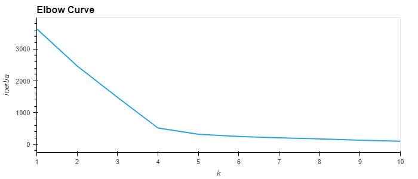

# Unsupervised - Crypto Market Analysis

## Objective:
create a report that includes what cryptocurrencies are on the trading market and how they could be grouped to create a classification system for this new investment.

## Tools
* Python
* Pandas
* Scikit-Learn
* K-Means
* hvPlot
* Plotlty Express
* Holoviews

## Exploration & Cleanup
```
print(loan_stats_df.shape)
(115675, 86)
print(loan_stats_df.isnull().values.any())
True
```
My first step with every data is to just gauge the size and whether or not there are null values. I see I'm working with a relatively small dataset, due to this being an aggregated dataset. I also do have null values, and I see there's no way to handle backfilling for this data. I'll need to drop these nulls.

```
crypto_df = crypto_df[crypto_df["IsTrading"] == True]
crypto_df.drop(columns=["IsTrading"], inplace=False)
```
Next I know Ithat I'm only interested in cryptocurrencies that are trading, so I'll be dropping all currencies that are not being traded. Also, now that all my data is being traded my column now provides nothing to the machine learning, so I'll be dropping that column as well.

```
crypto_df = crypto_df.dropna(axis=0, how="any")
crypto_df = crypto_df[crypto_df["TotalCoinsMined"] > 0]
```
Next I'll go ahead and drop all the null values I know that I have. I also see that
there are currencies currently being traded, that aren't being mined. This could mean
they're too new, or they're abandoned coins. Either way, this coins won't be good for investments so I'll drop them as well.

```
coins_name = pd.DataFrame(crypto_df["CoinName"], index=crypto_df.index)
crypto_df = crypto_df.drop("CoinName", axis=1)
```
The coin names won't contribute anything to the machine learning, but instead of just dropping them I want to set them aside for later after I do the machine learning, instead of relying on only the abbreviations for my "names".

## Machine Learning: Scaling
```
X = pd.get_dummies(data=crypto_df, columns=["Algorithm", "ProofType"])
```
Since my data contains string values, I'll first need to convert those over to binary.

```
X = StandardScaler().fit_transform(X)
```
Next I'll be applying the StandardScaler to my dataset in order to normalize my data.

## Machine Learning: Principle Component Analysis
Unsupervised linear transformation technique. PCA aims to find the directions of maximum variance in high-dimensional data and projects it onto a new subspace with equal or fewer dimensions than the original one.

```
n_comp = 3
pca = PCA(n_components=n_comp)
princ_comp = pca.fit_transform(X)
```
Here I'll be applying PCA to the dataset. Since my original dataset post-cleaning had 4 dimensions I'll be reducing it to 3.

```
col_names = [f"PC {i}" for i in range(1, n_comp + 1)]
pcs_df = pd.DataFrame(princ_comp, columns=col_names, index=crypto_df.index)
```
Here I'm creating a dataframe with the three principal components so I can work on K-Means in the next steps.

## Machine Learning: Clustering Using K-Means


I'm using an elbow curve to gain insight into how many clusters I need. I see here that after 4 clusters the data starts to normalize.

```
model = KMeans(n_clusters=4, random_state=0)
model.fit(pcs_df)
predictions = model.predict(pcs_df)
```
Setting up the KMeans clusters based off the elbow curve and get the predicted clusters.

```
clustered_df = pd.concat([crypto_df, pcs_df], axis=1, sort=False)
clustered_df["CoinName"] = coins_name["CoinName"]
clustered_df["Class"] = model.labels_
```
I'm creating a dataframe with the predicted clusters and cryptocurrency features. Inserting the KMEans model into a "Class" column.

## Visualizing Results
```
fig = px.scatter_3d(
    clustered_df,
    x="PC 1",
    y="PC 2",
    z="PC 3",
    color="Class",
    symbol="Class",
    hover_name="CoinName",
    hover_data=["Algorithm"],
    width=800,
)
fig.update_layout(legend=dict(x=0, y=1))
fig.show()
```
To visualize the clusters I'll be using hvplot and generating a 3d scatterplot where the (x, y, z) are PC dimensions.

```
clustered_df[
    [
        "CoinName",
        "Algorithm",
        "ProofType",
        "TotalCoinSupply",
        "TotalCoinsMined",
        "Class",
    ]
].hvplot.table()
```
I'll also be doing a hvplot plot to see the data from a more raw perspective.

```
mm_scaler = MinMaxScaler()
plot_data = mm_scaler.fit_transform(clustered_df[["TotalCoinSupply", "TotalCoinsMined"]])

plot_df = pd.DataFrame(plot_data, columns=["TotalCoinSupply", "TotalCoinsMined"], index=clustered_df.index)
plot_df["CoinName"] = clustered_df["CoinName"]
plot_df["Class"] = clustered_df["Class"]

plot_df.hvplot.scatter(x="TotalCoinsMined", y="TotalCoinSupply", hover_cols=["CoinName"], by="Class")
```
Since I want to see tradeable currencies on a 2d scatter plot, I'll be using "MinMaxScaler" to scale the data. Then create a new dataframe from that scalled dataset. I can use hvplot to plot the data based on TotalCounsMined vs TotalCoinSupply, while also giving it hover information for a more interactive visualization.